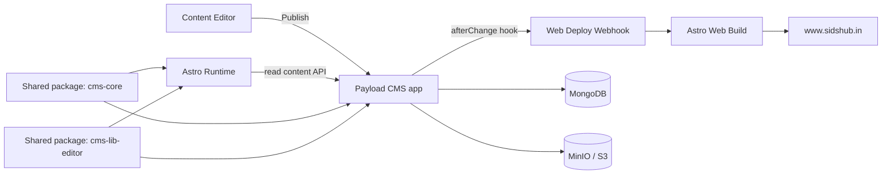

# Sid's Hub Workspace

[](https://www.sidshub.in)
[](https://bun.sh)
[](https://astro.build)
[](https://payloadcms.com)
[](https://www.typescriptlang.org)

Public monorepo behind [sidshub.in](https://www.sidshub.in).

This repository is a production-oriented reference for an Astro portfolio/blog frontend with a Payload CMS backend, shared schema packages, and container-first deployment workflows.

## Origin

This project started as a fork of [Astrofy](https://github.com/manuelernestog/astrofy) and has since evolved into a multi-app monorepo with a custom CMS workflow, shared internal packages, and deployment automation tailored for sidshub.in.

## Live Links

- Portfolio: https://www.sidshub.in
- Local Web: http://localhost:4321
- Local CMS Admin: http://localhost:3000/admin

## Why This Repo Is Useful

- Demonstrates a real Astro + Payload integration instead of a toy setup.
- Uses strict TypeScript across frontend, backend, and shared packages.
- Separates reusable CMS schema/editor logic into versioned workspace packages.
- Documents local development and deployment flows end-to-end.

## Highlights

- Monorepo with Bun workspaces and Turbo pipelines.
- Astro frontend with MDX content support, RSS, sitemap, and strict type checks.
- Payload CMS with MongoDB, optional S3-compatible storage (MinIO), and publish-triggered web deploy webhook.
- GitHub Actions image publishing to GHCR with path-aware Docker builds.
- Shared packages:
  - `@sidshub/cms-core` for collections, fields, hooks, and generated types.
  - `@sidshub/cms-lib-editor` for Lexical editor and web-side rich text helpers.
- Pre-commit quality gates with ESLint, Prettier, and Conventional Commit validation.

## Architecture



## Monorepo At A Glance

| Path                          | Purpose                                         |
| ----------------------------- | ----------------------------------------------- |
| `apps/web`                    | Astro 5 portfolio + blog frontend               |
| `apps/cms`                    | Payload CMS backend (Next.js runtime)           |
| `packages/cms-core`           | Shared Payload schema/config/access/hooks/types |
| `packages/cms-lib-editor`     | Shared Lexical editor integration (CMS + web)   |
| `docs/deployment/local/`      | Local infrastructure and developer workflow     |
| `docs/deployment/production/` | Production stack, env vars, publish flow        |

## Quick Start

### Prerequisites

- [Bun](https://bun.sh/)
- [Docker + Docker Compose](https://docs.docker.com/get-docker/)
- [Task](https://taskfile.dev/) (recommended)

### Run Locally

```bash
# 1) Install dependencies
bun install

# 2) Create env files
cp .env.cms.example apps/cms/.env
cp .env.web.example apps/web/.env

# 3) Start local infrastructure
task up:build
# or: docker compose -f deployment/docker-compose.local.yml up -d --build

# 4) Start app dev server and workspace package watchers
bun run dev:web
# or: bun run dev:cms / bun run dev:all
```

## Common Commands

```bash
bun run dev           # Alias to dev:web
bun run dev:web       # Run Astro with Turbo-managed package builds/watchers
bun run dev:cms       # Run Payload/Next with Turbo-managed package builds/watchers
bun run dev:all       # Run web, CMS, and shared package watchers together
bun run build         # Build web + cms
bun run build:web     # Build web only
bun run build:cms     # Build cms only
bun run build:test:web # Build web with mocked CMS env
bun run check:web     # Astro type checks
bun run payload:types # Regenerate Payload types
bun run lint          # Lint all workspaces
bun run format:check  # Prettier check
```

## Documentation Map

- Local setup and service orchestration: [docs/deployment/local/setup.md](docs/deployment/local/setup.md)
- Production deployment overview: [docs/deployment/production/overview.md](docs/deployment/production/overview.md)
- Dokploy setup: [docs/deployment/production/dokploy/setup.md](docs/deployment/production/dokploy/setup.md)
- Web app internals: [apps/web/README.md](apps/web/README.md)
- CMS internals: [apps/cms/README.md](apps/cms/README.md)
- Shared CMS core package: [packages/cms-core/README.md](packages/cms-core/README.md)
- Shared editor package: [packages/cms-lib-editor/README.md](packages/cms-lib-editor/README.md)

## Quality And Standards

- Strict TypeScript settings are enabled in both web and cms apps.
- Git hooks run lint-staged checks on staged files.
- Commit messages are validated using Conventional Commits.
- `build:web` is fail-fast: it requires a reachable CMS API preflight.
- No dedicated automated test suite is configured yet; build, check, and lint gates are currently the primary quality guardrails.

## Security For A Public Repo

- Never commit `.env` files, credentials, or tokens.
- Keep secrets in environment variables managed by your platform.
- Keep PRs scoped to the relevant app/package and run related checks before opening a PR.

## Roadmap

- [ ] Add automated test baseline (Vitest) for shared libraries.
- [ ] Add CI workflow badges after public pipeline setup.
- [ ] Expand architecture docs with deployment sequence diagrams.

## Contributing

Contributions are welcome.

Before opening a PR:

1. Run relevant checks (`bun run build:web`, `bun run build:cms`, or `bun run build`).
2. Keep changes focused and documented.
3. Follow existing code style and commit conventions.

## License

This repository is public, but no license file is currently present.

If you plan to accept external code reuse, add a `LICENSE` file (for example MIT or Apache-2.0).
