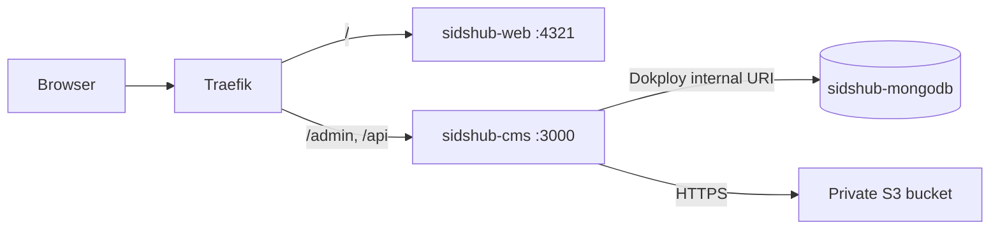

# Production Deployment Overview

Production consists of three independently managed Dokploy resources. Root `docker-compose.yml` is local-development infrastructure only; it runs MongoDB, MinIO, and the MinIO bucket bootstrapper. It is never deployed to Dokploy.

## Topology

- `sidshub-mongodb` is a managed Dokploy MongoDB database with persistent storage. It has no domain and no Advanced port.
- `sidshub-cms` is a Dockerfile Dokploy Application. It alone shares Dokploy internal networking with MongoDB and uses the generated Internal Connection URL as `DATABASE_URI`.
- `sidshub-web` is a separate Dockerfile Dokploy Application. It consumes public CMS data at the same HTTPS origin plus `/api` during its build.
- The shared public hostname keeps the established contract: `/` reaches web and `/admin` and `/api` reach CMS. Add the CMS paths before `/`.
- Media lives in a private external S3-compatible bucket. It is reached over HTTPS, never through a Dokploy network alias or a host-published MinIO port. Payload continues to serve access-controlled media.

Dokploy application domain changes reload through Traefik's file provider. Configure only Traefik domain routes for CMS and web; do not add Advanced ports for public traffic or any MongoDB port.

## Application builds

Both Applications use repository-root context `.` and their respective Dockerfiles. The Dockerfiles retain `turbo prune --docker`, frozen Bun installs, builder/runtime separation, non-root runtime users, and their published container ports.

The build stages mount isolated BuildKit Turbo caches: `sidshub-turbo-web` and `sidshub-turbo-cms`. Dokploy invokes each Dockerfile; Turborepo only runs because the Dockerfiles execute `turbo run build`. `.turbo` is excluded from the build context and runtime images, so no cross-deploy Turbo cache exists without the mount. The mount persists only when Dokploy reuses its BuildKit builder. An external build server needs persistent builder cache or an explicitly configured Turbo remote cache. Existing Docker layer reuse still preserves pruned dependency-install layers when inputs are unchanged.

Use Dockerfile build arguments only for public build configuration, never secrets. Build-time secrets are required if a build needs sensitive values.

## Storage contract

Create the configured bucket in its target region. Block anonymous public access. Grant the CMS access key only bucket/prefix-scoped object read, write, delete, and list permissions. Store `S3_ACCESS_KEY_ID` and `S3_SECRET_ACCESS_KEY` only in scoped Dokploy service secrets—not Git, Dockerfile `ARG`, or build arguments.

For AWS S3 leave `S3_ENDPOINT` unset; Payload uses virtual-host addressing. Set `S3_ENDPOINT` only for an S3-compatible provider that requires it; local Compose always uses `http://localhost:9000` and path-style addressing.

## Operations

Roll back either Application by redeploying its desired source revision; MongoDB and S3 data require their respective backup/restore procedures.

See the complete operator procedure in [Dokploy setup](dokploy/setup.md).

## Sources and operational caveats

- [Dokploy Dockerfile applications](https://docs.dokploy.com/docs/core/applications/build-type)
- [Dokploy domains](https://docs.dokploy.com/docs/core/domains)
- [Dokploy database connections](https://docs.dokploy.com/docs/core/databases/connection)
- [Payload S3 storage adapter](https://payloadcms.com/docs/upload/storage-adapters)
- Dokploy operational constraints: [shared-network DNS](https://github.com/Dokploy/dokploy/issues/1335), [build-time runtime-network limitation](https://github.com/Dokploy/dokploy/issues/2413), [Compose remote-build-server limitation](https://github.com/Dokploy/dokploy/issues/4148), and [ordinary Compose `--build` cache limitation](https://github.com/Dokploy/dokploy/issues/5020).
