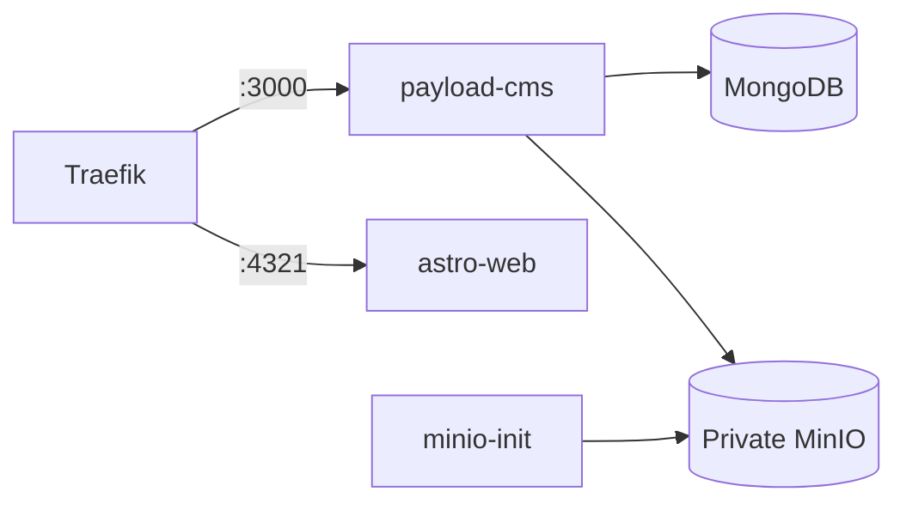

# Production Deployment Overview

Production uses one root `docker-compose.yml` containing `mongodb`, `minio`,
`minio-init`, `payload-cms`, and `astro-web`. Copy `.env.example` to `.env` and
provide platform-managed secrets; do not commit the resulting file.

## Architecture



Dokploy's native Traefik terminates TLS, routes domains, redirects HTTP, and supports
WebSockets. No Nginx sidecar is required. Route the CMS domain to `payload-cms:3000`
and the web domain to `astro-web:4321` through Dokploy's service domain settings.

MinIO has no public domain. Its host bindings are localhost-only in Compose, and
Payload reaches it over Docker DNS at `http://minio:9000`. The bootstrap service
creates `S3_BUCKET` and applies an anonymous `none` policy. Media is served through
Payload access-controlled endpoints.

## Build and startup

The CMS image is pulled from GHCR by default and can also be built locally through the
compose `build` fallback. The Astro image is built locally because its SSG build fetches
content from the CMS API using `ASTRO_CMS_READ_TOKEN`.

On first deployment:

1. Deploy the compose project with the CMS and backing services.
2. Open the CMS admin, create an administrator, and seed required content.
3. Ensure `ASTRO_CMS_API_URL` and `ASTRO_CMS_READ_TOKEN` point to the seeded CMS.
4. Rebuild/redeploy `astro-web`.

```bash
docker compose up -d mongodb minio minio-init
docker compose up -d payload-cms
# Seed CMS content, then:
docker compose build astro-web
docker compose up -d astro-web
```

## Environment

Required CMS values include `PAYLOAD_SECRET`, `PAYLOAD_PUBLIC_SERVER_URL`,
`ASTRO_SITE_URL`, `CMS_READ_TOKEN`, and email settings. Web build values are
`ASTRO_CMS_API_URL` and `ASTRO_CMS_READ_TOKEN`; the latter must match `CMS_READ_TOKEN`.
S3 values are `S3_BUCKET`, `S3_REGION`, `S3_ACCESS_KEY_ID`, and
`S3_SECRET_ACCESS_KEY`. Optional webhook and Dokploy cache-busting values are listed
in `.env.example`.

Compose sets `DATABASE_URI`, `S3_ENDPOINT`, `NODE_ENV`, `HOST`, and `PORT` so these
values remain aligned with the internal service topology.

## Ongoing deployments and rollback

```bash
# Pull a published CMS image and restart it
docker compose pull payload-cms
docker compose up -d payload-cms

# Rebuild web after code/content changes
docker compose build astro-web
docker compose up -d astro-web
```

Set `IMAGE_TAG` to an immutable GHCR tag for CMS rollback. Revert the source revision
and rebuild `astro-web` to roll back the web output.

## Platform Guides

- Dokploy: [`dokploy/setup.md`](dokploy/setup.md)
- Manual Compose/custom proxy: [`custom/setup.md`](custom/setup.md)
